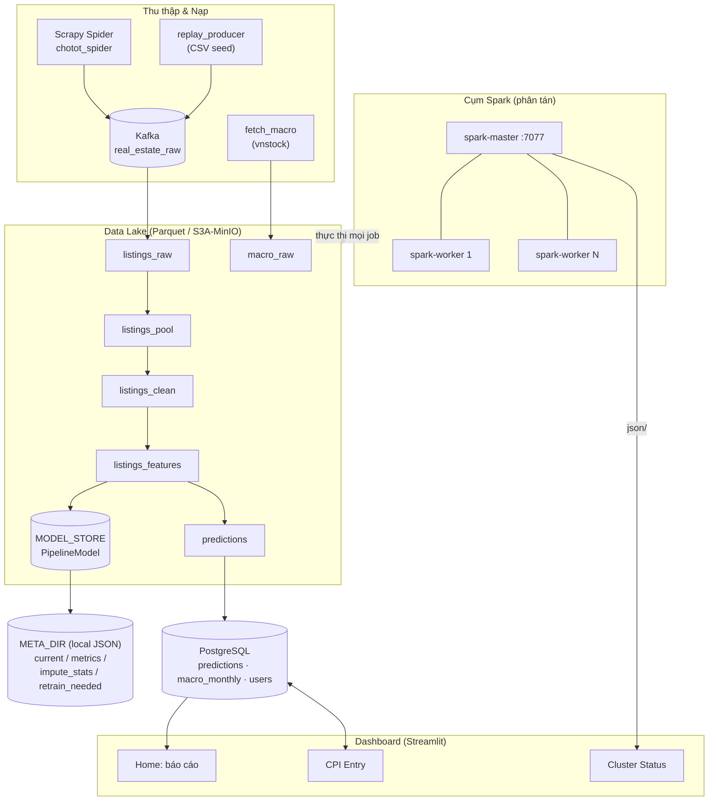
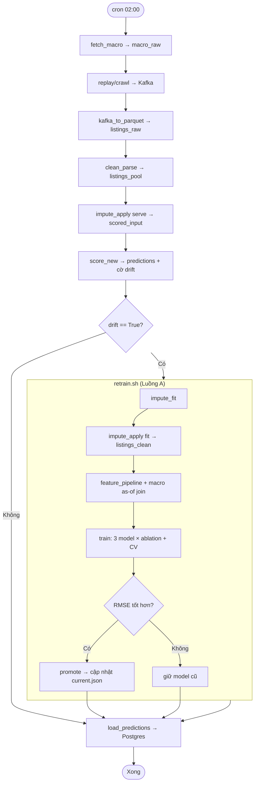
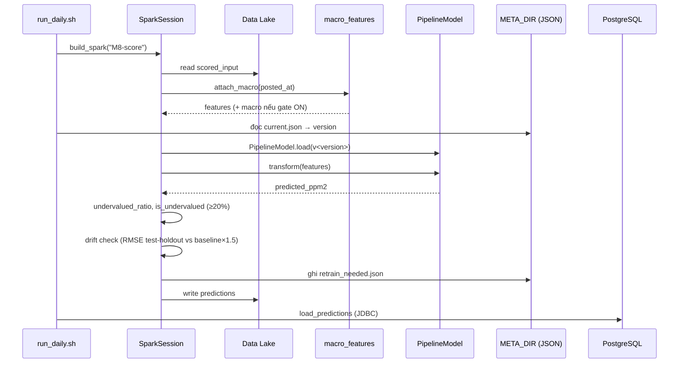

# System Architecture & Documentation
## Hệ thống Định giá Bất động sản Phân tán (Real Estate Valuation)

> Tài liệu kiến trúc kỹ thuật. Đối tượng đọc: thành viên dự án, người tiếp nhận bàn giao và hội đồng bảo vệ đồ án.
> Phạm vi: toàn bộ mã nguồn từ crawl dữ liệu → xử lý phân tán Spark → huấn luyện/chấm điểm ML → phục vụ dashboard.

---

## 1. Tổng quan dự án & Chức năng chính

### 1.1. Mục tiêu

Hệ thống thu thập tin rao bán bất động sản tại **TP. Hồ Chí Minh** (nguồn Chợ Tốt), huấn luyện mô hình hồi quy để **dự đoán giá hợp lý (triệu VND/m²)** cho từng tin, rồi phát hiện các tin **định giá thấp** (giá rao rẻ hơn giá mô hình dự đoán ≥ 20%). Kết quả được trực quan hóa qua dashboard web.

Điểm nhấn kiến trúc: toàn bộ khối tính toán chạy trên **cụm Spark phân tán** (nhiều máy/nhiều container), có **pipeline hằng ngày tự động** với cơ chế **phát hiện trôi mô hình (drift) → huấn luyện lại có điều kiện → chỉ thăng cấp nếu tốt hơn**.

### 1.2. Chức năng cốt lõi

| # | Chức năng | Mô tả | Nơi hiện thực |
|---|-----------|-------|---------------|
| 1 | **Thu thập dữ liệu (crawl)** | Cào API Chợ Tốt theo vùng HCM + 4 nhóm BĐS, phân trang bằng `offset`, parse trường tiếng Việt | [scraper/realestate/spiders/chotot_spider.py](scraper/realestate/spiders/chotot_spider.py) |
| 2 | **Nạp luồng (streaming ingest)** | Tin cào → Kafka topic `real_estate_raw` → hạ cánh Parquet thô phân vùng theo ngày | [scraper/realestate/pipelines.py](scraper/realestate/pipelines.py), [streaming/kafka_to_parquet.py](streaming/kafka_to_parquet.py) |
| 3 | **Replay seed** | Phát lại CSV cũ → Kafka để demo/chạy hằng ngày khi chưa bật crawl thật | [streaming/replay_producer.py](streaming/replay_producer.py) |
| 4 | **ETL làm sạch** | Parse kiểu, lọc scope (HCM/bán/diện tích>0), tính `price_per_m2`, gán tier quận (`rank_quan`), giữ null | [ml/clean_parse.py](ml/clean_parse.py) |
| 5 | **Đặc trưng vĩ mô (macro)** | As-of join CPI/lãi suất + vàng/USD/VNINDEX theo `posted_at`, có "cổng" bật/tắt theo độ phủ dữ liệu | [ml/macro_features.py](ml/macro_features.py), [ml/fetch_macro.py](ml/fetch_macro.py) |
| 6 | **Impute (điền khuyết đóng băng)** | Học thống kê điền khuyết 1 lần (fit) rồi áp dụng cố định (serve) để tránh lệch train/serve | [ml/impute_fit.py](ml/impute_fit.py), [ml/impute_apply.py](ml/impute_apply.py) |
| 7 | **Xây đặc trưng ML** | Spark ML Pipeline: SQLTransformer → StringIndexer/OneHot → VectorAssembler → StandardScaler | [ml/feature_pipeline.py](ml/feature_pipeline.py) |
| 8 | **Huấn luyện + tuning + ablation** | So 3 regressor (LinearRegression/RandomForest/GBT) × có/không macro, CrossValidator, lưu PipelineModel có version | [ml/train.py](ml/train.py) |
| 9 | **Chấm điểm + phát hiện drift** | Nạp model, `transform` lô mới → cờ định giá thấp; drift check RMSE vs baseline → ghi cờ retrain | [ml/score_new.py](ml/score_new.py) |
| 10 | **Thăng cấp có điều kiện** | Chỉ trỏ model prod sang bản mới nếu RMSE tốt hơn (`current.json`) | [ml/promote.py](ml/promote.py) |
| 11 | **Phục vụ (serving)** | Ghi bảng dự đoán Parquet → Postgres qua JDBC | [ml/load_predictions.py](ml/load_predictions.py) |
| 12 | **Dashboard web** | Báo cáo dự đoán, nhập CPI thủ công, giám sát cụm Spark — có đăng nhập bcrypt | [dashboard/](dashboard/) |
| 13 | **Điều phối hằng ngày** | Nối toàn bộ pipeline, rẽ nhánh drift-retrain | [run_daily.sh](run_daily.sh), [ml/retrain.sh](ml/retrain.sh) |

---

## 2. Tech Stack & Cách áp dụng

### 2.1. Bảng công nghệ

| Công nghệ | Vai trò trong dự án | Áp dụng ở đâu |
|-----------|---------------------|---------------|
| **Scrapy** (async spider) | Framework crawl; gọi API JSON Chợ Tốt, phân trang offset, parse → `PropertyItem` | `scraper/realestate/` — spider + `items.py` + `settings.py` |
| **Apache Kafka** (KRaft, 1 broker) | Hàng đợi phân tách nguồn tin khỏi xử lý; topic `real_estate_raw` | Producer: `pipelines.py`, `replay_producer.py`; Consumer: `kafka_to_parquet.py` |
| **Apache Spark 4.x** | Bộ máy tính toán phân tán trung tâm cho **mọi** job (ETL + ML + streaming) | Toàn bộ `ml/*.py` và `streaming/*.py`; cấu hình tập trung ở `config.py` |
| **Spark Structured Streaming** | Đọc Kafka → Parquet với `trigger(availableNow=True)` (đọc offset mới rồi dừng), checkpoint tích lũy | `streaming/kafka_to_parquet.py` |
| **Spark MLlib** (`pyspark.ml`) | Pipeline đặc trưng + 3 regressor + `CrossValidator`/`ParamGridBuilder` + `RegressionEvaluator` | `feature_pipeline.py`, `train.py`, `score_new.py` |
| **Parquet Data Lake** | Lưu trữ phân tầng theo giai đoạn (raw → pool → clean → features → predictions), phân vùng `dt` | Thư mục `data/lake/*`, root cấu hình qua `LAKE_ROOT` |
| **MinIO / S3 (S3A)** | Object store cho data lake + binary model khi chạy multi-node (thay filesystem cục bộ) | `config.py::_s3_conf` bật khi path là `s3a://`; service `minio` + `minio-init` |
| **PostgreSQL 15** | Lớp phục vụ (serving): bảng `predictions`, `macro_monthly` (CPI/lãi suất), `users` (auth) | `sql/init.sql`, đọc/ghi qua JDBC trong `config.py::pg_read`, `load_predictions.py`, `dashboard/db.py` |
| **Streamlit** | Ứng dụng web dashboard đa trang | `dashboard/Home.py` + `dashboard/pages/*` |
| **bcrypt** | Băm mật khẩu đăng nhập dashboard (không lưu plaintext) | `dashboard/auth.py`, `dashboard/manage_users.py`, bảng `users` |
| **vnstock** | Lấy chuỗi thị trường vĩ mô (vàng/USDVND/VNINDEX) | `ml/fetch_macro.py` |
| **Docker Compose** | Đóng gói & điều phối toàn cụm 1 host (mọi service ML dùng chung 1 image) | `docker-compose.yml`, `Dockerfile` |
| **JDBC** (`org.postgresql`) | Cầu nối Spark ↔ Postgres | `PG_DRIVER_PKG` trong `config.py` |

### 2.2. Các pattern kiến trúc quan trọng

- **Single Source of Config** — [ml/config.py](ml/config.py) là **nguồn cấu hình duy nhất**: mọi path (`LAKE`, `MODEL_STORE`, `META_DIR`, `RAW_CSV`), thông tin Spark master, và kết nối Postgres đều đọc từ biến môi trường với default = hành vi local. Cả `dashboard/db.py` và `streaming/*` cũng `import` lại từ đây để không trùng lặp cấu hình.

- **Phân tầng lưu trữ (Storage Tiering)** — chủ ý tách theo *ai truy cập*:
  - `LAKE` → Parquet, executor Spark đọc/ghi (prod: `s3a://.../lake`)
  - `MODEL_STORE` → PipelineModel + feature pipeline (prod: `s3a://.../models`)
  - `META_DIR` → **JSON điều khiển nhỏ**, driver đọc bằng `open()` nên **bắt buộc local, không s3a** (`impute_stats.json`, `current.json`, `metrics.json`, `retrain_needed.json`)
  - `RAW_CSV` → CSV seed tĩnh (bind mount)

- **No Python UDF** — pipeline cố ý không dùng UDF Python để executor chạy **JVM thuần**, không cần Python trên worker → triển khai phân tán đơn giản, tránh lỗi môi trường.

- **Tách tín hiệu khỏi hành động (drift)** — `score_new.py` **chỉ ghi cờ** `retrain_needed.json`; việc có retrain hay không do orchestrator (`run_daily.sh`) quyết định. Giúp mỗi bước idempotent, dễ kiểm thử.

- **Promote-if-better** — model mới huấn luyện xong **không** tự lên prod; `promote.py` so RMSE với `current.json` và chỉ dời con trỏ khi tốt hơn → an toàn cho production.

- **Đối xứng train/serve** — feature stages nằm **trong** `PipelineModel` (fit trên train split), `score_new.py` nạp đúng 1 artifact và `transform` → loại trừ lệch train/serve.

- **Macro gate** — `attach_macro()` chỉ bật đặc trưng vĩ mô khi dữ liệu đủ phủ (≥ 6 tháng span **và** ≥ 3 tháng phân biệt); nếu không, trả 0 cột macro để tránh nhiễu.

### 2.3. Lớp hạ tầng phân tán

`config.py::build_spark()` là "nhà máy" tạo `SparkSession` chuẩn cho mọi job:
- `master` = `SPARK_MASTER` (default `local[*]` cho dev; prod = `spark://<master>:7077`).
- Tự bật cấu hình **S3A** (endpoint/credential MinIO, `fast.upload=bytebuffer` để tránh lỗi `buffer.dir` trên worker container) khi phát hiện path `s3a://`.
- `packages` chỉ nạp jar qua Ivy khi cần (vd JDBC), prod bake sẵn trong image.

---

## 3. Luồng chạy ứng dụng (Execution Flow)

### 3.1. Bootstrap (khởi chạy hạ tầng)

`docker compose up` khởi động nền tảng (xem `docker-compose.yml`):

1. **minio** (object store) → healthcheck live.
2. **minio-init** — tạo bucket lake/model + upload CSV seed macro (chạy 1 lần, idempotent).
3. **kafka** (KRaft single-broker) — auto-create topic.
4. **postgres** — chạy `sql/init.sql` lần đầu: tạo bảng `predictions`, `macro_monthly` (seed CPI 2025-01…2026-01), `users`.
5. **spark-master** (`:7077` submit, `:8080` UI) → healthcheck.
6. **spark-worker** — scale nhiều bản (`--scale spark-worker=N`), tự join master.

Mọi service ML (master/worker/ml-app) **dùng chung 1 image** `realestate-ml:latest`. Job hằng ngày (`ml-app`) là **ephemeral**, không auto-start mà gọi qua cron:
```
0 2 * * *  docker compose run --rm ml-app bash run_daily.sh
```

### 3.2. Luồng dữ liệu chính — `run_daily.sh`

Pipeline hằng ngày nối các bước (số bước khớp comment trong `run_daily.sh`):

| Bước | Lệnh | Đầu vào → Đầu ra |
|------|------|------------------|
| 0 | `fetch_macro.py` | vnstock → `macro_raw` lake (non-fatal: lỗi thì carry-forward) |
| 1 | `replay_producer.py` (hoặc crawl thật) | CSV/API → **Kafka** `real_estate_raw` |
| 2 | `kafka_to_parquet.py` | Kafka → `listings_raw` (Parquet, partition `dt`) |
| 3 | `clean_parse.py` | `listings_raw` → `listings_pool/dt=today` (parse + scope + `price_per_m2` + `rank_quan`, **giữ null**) |
| 4 | `impute_apply.py --mode serve` | `listings_pool/dt=today` → `scored_input` (điền khuyết bằng stats đóng băng) |
| 5 | `score_new.py` | `scored_input` → `predictions` lake + **ghi cờ** `retrain_needed.json` |
| 6 | *rẽ nhánh* | Nếu `drift == True` → `retrain.sh`; nếu không → giữ model |
| 7 | `load_predictions.py` | `predictions` lake → **Postgres** (non-fatal) |

### 3.3. Hai luồng logic

**Luồng B — Serve (mỗi ngày, không train lại):**
`clean_parse → impute serve → score_new → load_predictions`. Đây là đường đi mặc định, rẻ về tính toán.

**Luồng A — Retrain (chỉ khi drift):** `ml/retrain.sh` chạy:
`impute_fit` (học lại stats trên toàn pool) → `impute_apply --mode fit` (ghi `listings_clean/sale`) → `feature_pipeline` (build recipe + as-of join macro) → `train` (tuning + ablation + lưu `v<date>/model` + `metrics.json`) → `promote` (so RMSE, cập nhật `current.json` nếu tốt hơn).

**Chi tiết chấm điểm & drift** (`score_new.py`):
- `prediction` → `predicted_ppm2` (triệu/m²); `undervalued_ratio = (pred − thực)/pred`; cờ `is_undervalued` khi ≥ 20%.
- Drift check dùng RMSE **chỉ trên test-holdout** (`randomSplit` seed=42 y hệt train) để tránh số lạc quan; drift khi `RMSE > 1.5 × baseline_rmse`.

### 3.4. Luồng phục vụ (serving) & Dashboard

- `load_predictions.py` đọc `predictions` Parquet → ghi bảng `predictions` Postgres (JDBC).
- Streamlit đọc Postgres qua `dashboard/db.py` (tái dùng config từ `ml/config.py`):
  - **Home** — chọn đợt chấm, thẻ chỉ số, 3 biểu đồ (giá thực vs dự đoán theo quận, số tin định giá thấp, phân bố chênh lệch). Có `auth.require_login()`.
  - **CPI Entry** — nhập/UPSERT `macro_monthly` thủ công.
  - **Cluster Status** — đọc JSON `<master>/json/` (`dashboard/cluster.py::parse_master`), đếm `distinct_hosts()` để **chứng minh chạy trên nhiều máy vật lý**.
- Đăng nhập: `auth.py` xác thực bcrypt so với bảng `users` (bảo vệ vì tunnel công khai).

---

## 4. Sơ đồ kiến trúc

### 4.1. Kiến trúc thành phần & triển khai



### 4.2. Flowchart — pipeline hằng ngày (`run_daily.sh`)



### 4.3. Sequence Diagram — chấm điểm 1 lô tin



---

## Phụ lục — Ghi chú vận hành

- **Đơn vị giá**: `price_per_m2` và mọi `*_ppm2` = **triệu VND/m²**; `predicted_total_vnd` = VND.
- **JAVA_HOME**: prod (container/Linux) luôn set env; `config.py` chỉ fallback JDK 17 khi dev bare-metal chưa export.
- **META_DIR bắt buộc local**: các JSON điều khiển được driver đọc bằng `open()`, **không** được trỏ s3a.
- **Non-fatal**: `fetch_macro`, `replay_producer`, `load_predictions` thất bại **không** chặn pipeline (Kafka/Postgres down vẫn chạy tiếp).
- **Kiểm thử**: `tests/` phủ `dashboard/db.py` (pure builders), `cluster.py` (parse master JSON), `macro_features.py`.
